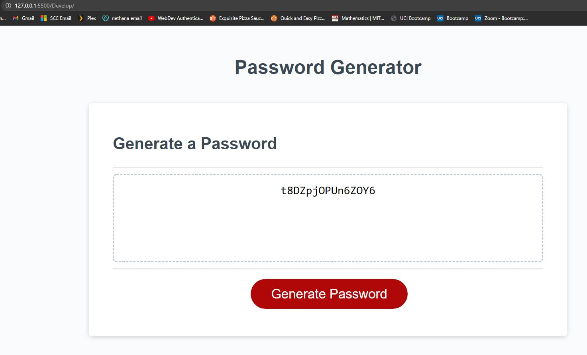

# UCI HW3 password_generator
## Description
You are able to generate a random password by choosing a password length (which must be a number between 8 and 128) and choosing which kind of characters you would like to have in the password (lower case, upper case, numeric, special characters). Then a password meeting your requirements is generated and output in the textfield.
## Here's a screenshot:

## Links:
github:https://github.com/dylster1995/password_generator

hosted: https://dylster1995.github.io/password_generator/
